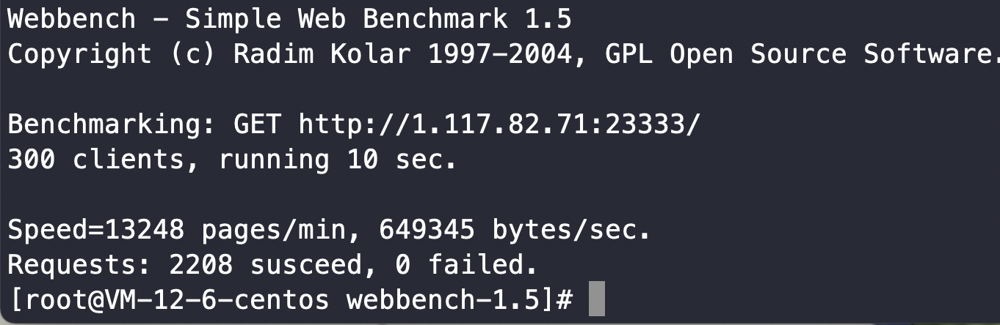

## xwebs
* about<br>
  reactor高性能web服务器
* dependence<br>
  Linux即可，只支持epoll，不支持跨平台
* build<br>
  ```shell
  cmake CMakeLists.txt
  make
  ```

* usage<br>
  -p:指定端口号（默认23333）<br>
  -m:mode（固定边沿触发）<br>
  -t:timeout，事件响应超时（默认6000ms)<br>
  -n:线程数（默认6）<br>
  ```shell
  xwebs -p 1111 -m 3 -t 6000 -n 6
  ```
* test<br>
  云服务器2C1G
  
* reference<br>
  * mudou:<https://github.com/chenshuo/muduo.git>
